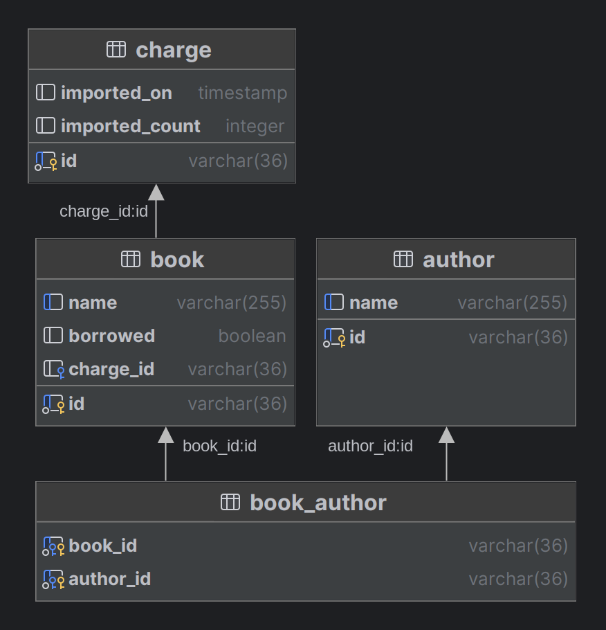

# BookService

Developing Prototypes and Demonstrating Usage of Features in Java Spring, Associated Frameworks, and Docker Deployment

- rest controller : class Controller
  - validation of dto in controller level
  - file upload using multipartfile
  - swagger api configuration

- domain logic : class Core
  - @Transactional for all database related operations
  - use mapstruct to map EO to DTO
  - csv file processing, creation and persistence of cascade data structure   : class Importer
  - concurrency pattern implementation for exclusive database record checkout : class Borrow
  - mapstruct use for cascade mapping of objects having OneToMany, ManyToMany relations
    - explicit configuration for ignore deep mapping to avoid circular mapping calls

- data persistence
  - postgres db
  - relations
    - @OneToMany
    - @ManyToOne
    - @ManyToMany
    - cascade persist of structure with children and related objects
  - LAZY loading fetch strategy
  - database setup using flyway
  - @Query using row lock and skip locked for concurrency pattern implementation

- initial data setup
  - class InitialDataSetup triggers the data import on application startup
  - using profile "import" ( --spring.profiles.active=import ) which ist set in application.yml
  - call the data import in asynchronous way calling
    * CompletableFuture.supplyAsync(() -> {

      return importer.importBooks(inputStream);

      });
    
  - integration tests will don't call it, because they are running with profile "test"

- integration test
  - using profile "test"
  - real rest controller test using spring rest client
  - controller test using MockMvc
  - use H2 in-memory database
  - use @Transactional in H2 Database tests to rollback database after test execution
  - use test file resource

- docker deployment
  - compose file for application and database
  - docker file

- sonarQube
  - use local sonarQube configured according https://www.baeldung.com/sonar-qube
  - clean verify sonar:sonar -Dsonar.projectKey=BookService -Dsonar.projectName='BookService'
    -Dsonar.host.url=http://localhost:9001 -Dsonar.token=sonar_token -f pom.xml

## 1. Database diagram



## 2. Setup local development environment

### 2.1 Database

```
docker run -d --name golo-book-service-db-dev -e TZ=UTC -p 31432:5432 -e POSTGRES_DB=golo-book-service-db -e POSTGRES_USER=golo -e POSTGRES_PASSWORD=qFkJj92N9A4E --restart=always postgres:15

```

## 3. Deploy the Application and Database as docker container
copy target/application.jar to src/main/docker
- in terminal goto /src/main/docker
    - run docker-compose build
    - run docker-compose up

## 4. Table join example

SELECT
b.id AS book_id,
b.name AS book_name,
b.borrowed AS book_borrowed,
b.charge_id AS book_charge_id,
a.id AS author_id,
a.name AS author_name

FROM
book b

JOIN book_author ba ON b.id = ba.book_id

JOIN author a ON a.id = ba.author_id;